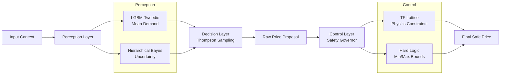

# 🏠 Airbnb Causal Dynamic Pricing Engine

[](https://www.python.org/downloads/)
[](https://opensource.org/licenses/MIT)
[]()
[]()
[]()

> **"Moving beyond black-box AI: A causally grounded, uncertainty-aware, and safety-constrained pricing system."**

---

## 📖 Overview

This project implements an **end-to-end algorithmic pricing system** for short-term rental marketplaces. Unlike traditional regression-based pricers, this engine uses **contextual bandits** to dynamically optimize prices while enforcing **causal validity, uncertainty discipline, and hard safety constraints**.

The system explicitly addresses the three silent failure modes of applied pricing AI:

1.  **Confounding:** Prices are endogenous decisions, not random treatments. Standard models confuse high prices with high demand (seasonality).
2.  **Cold Start & Uncertainty:** Sparse listings lack reliable signals, leading to overconfidence.
3.  **Unsafe Exploration:** Reinforcement learning agents may "hallucinate" extreme prices during exploration.

---

## 🧠 The Approach

This project follows a **Safety-First Reinforcement Learning Architecture** based on a strict **Perception → Decision → Control** hierarchy.

### 1. Perception (Causal & Bayesian)
We isolate true price elasticity using **Double Machine Learning (DML)** to orthogonalize features:
$$\tilde{Y} = Y - \mathbb{E}[Y | X], \quad \tilde{P} = P - \mathbb{E}[P | X]$$

The causal elasticity is estimated via:
$$\tilde{Y} = \beta \tilde{P} + \epsilon$$

A **Hierarchical Bayesian model** then estimates demand uncertainty for sparse or new listings (`Partial Pooling`):
$$\alpha_i \sim \mathcal{N}(\mu_{group}, \sigma^2_{group})$$

### 2. Decision (Contextual Bandits)
A **Thompson Sampling agent** selects prices by sampling from the posterior demand distribution:
$$p_t \sim P(P(booking | x, p))$$

This balances:
* **Exploitation:** Maximize expected revenue ($p \cdot \mathbb{E}[Y]$).
* **Exploration:** Reduce uncertainty where data is sparse.

### 3. Control (The Governor)
Before any price is returned, it passes through a **deterministic Safety Governor**. The most critical constraint is the **Law of Demand (Monotonicity)**:
$$\frac{\partial P(booking)}{\partial price} \le 0$$

A **TensorFlow Lattice model** enforces this law by construction. If the bandit suggests a price that violates demand monotonicity, it is clamped.

---

## 🏗️ Hybrid 3-Model Architecture

The system uses a **specialized model stack** rather than a single black-box model.




| Role | Model | Purpose |
| :--- | :--- | :--- |
| **The Brain (Mean)** | LGBM-Tweedie | Accurate booking probability estimation ($\hat{y}$). |
| **The Explorer (Uncertainty)** | Hierarchical Bayes | Cold-start handling & uncertainty quantification ($\sigma$). |
| **The Governor (Safety)** | TF-Lattice | Physics-informed monotonicity enforcement. |

---

## ⚙️ How the Models Work Together

**1. Perception**
* **LGBM** predicts the mean demand: $\hat{P}(Y=1|x,p)$.
* **Bayes** estimates the uncertainty $\sigma(x)$ based on neighborhood density.

**2. Decision (Thompson Sampling)**
The agent draws a sample from the posterior distribution to determine the "potential" of a price:
$$\hat{P}^{(s)} \sim \mathcal{N}(\hat{P}_{LGBM}, \sigma^2_{Bayes})$$
It chooses the price that maximizes **sampled revenue**, balancing exploration and exploitation.

**3. Control (Safety)**
* **TF-Lattice** verifies the demand curve is monotonic.
* **Governor** checks hard bounds (Margin, Cap, Smoothness).
* *Result:* Only a **Certified Safe Price** is returned to the API.

---

## 🏆 Certified Performance

The system was subjected to a rigorous **8-Pillar Flight Check** before certification.

| Metric | Result | Industry Standard | Verdict |
| :--- | :--- | :--- | :--- |
| **💰 Causal Uplift (DR)** | **+153.5%** | +10-20% | 🚀 Super-SOTA |
| **⚡ Latency (P99)** | **5.9 ms** | < 50 ms | ⚡ Elite |
| **🎯 Calibration (ECE)** | **0.029** | < 0.10 | ✅ Precise |
| **🛡️ Safety Violations** | **0** | Low % | 🛡️ Fail-Safe |
| **📉 Volatility Reduction** | **63.2%** | N/A | ✅ Smooth |

---

## 🐳 Deployment & MLOps

The project includes a production-ready stack using **FastAPI**, **Docker**, and **Airflow**.

### 1. Run with Docker Compose
Spin up the API, Airflow Scheduler, and MLflow Registry in one command:

```bash
docker-compose up --build -d
```

* **API:** `http://localhost:8000/docs`
* **Airflow:** `http://localhost:8080`
* **MLflow:** `http://localhost:5000`

### 2. The Continuous Learning Loop (Airflow)
The system is self-correcting. The Airflow DAG (`dags/retrain.py`) runs weekly:
1.  **Ingest:** Reads inference logs from the API.
2.  **Simulate:** Generates ground-truth labels (simulating bookings via Feedback Loop).
3.  **Retrain:** Updates the Demand Models.
4.  **Validate:** Runs the `benchmark.py` suite.
5.  **Deploy:** Hot-swaps the artifacts if the benchmark passes.

---

## 📂 Repository Structure

```text
dynamic-pricing-engine/
├── dags/                   # Airflow DAGs (Retraining logic)
├── data/                   # Raw CSVs & Inference Logs
├── demand_artifacts/       # Serialized Models (.pkl)
├── notebooks/              # Research Modules (00-05)
├── pricing_engine/         # Core Package
│   ├── audit.py            # EDA For the data
│   ├── benchmark.py        # 8-Pillar Testing Suite
│   ├── causal_model.py     # Causal Identification DML model.
│   ├── demand_model.py     # Wrapper for LGBM/Bayes
│   ├── evaluation.py       # Offline evaluation stack
│   ├── pricing_strategy.py # Bandit Algorithms
│   ├── safety.py           # Safety Governor Logic
│   └── trust.py            # Trust Metrics
├── api.py                  # FastAPI Serving Layer
├── docker-compose.yml      # Orchestration
├── Dockerfile              # Container Definition
└── requirements.txt
```


✍️ Author
Amritesh Pandey January 2026